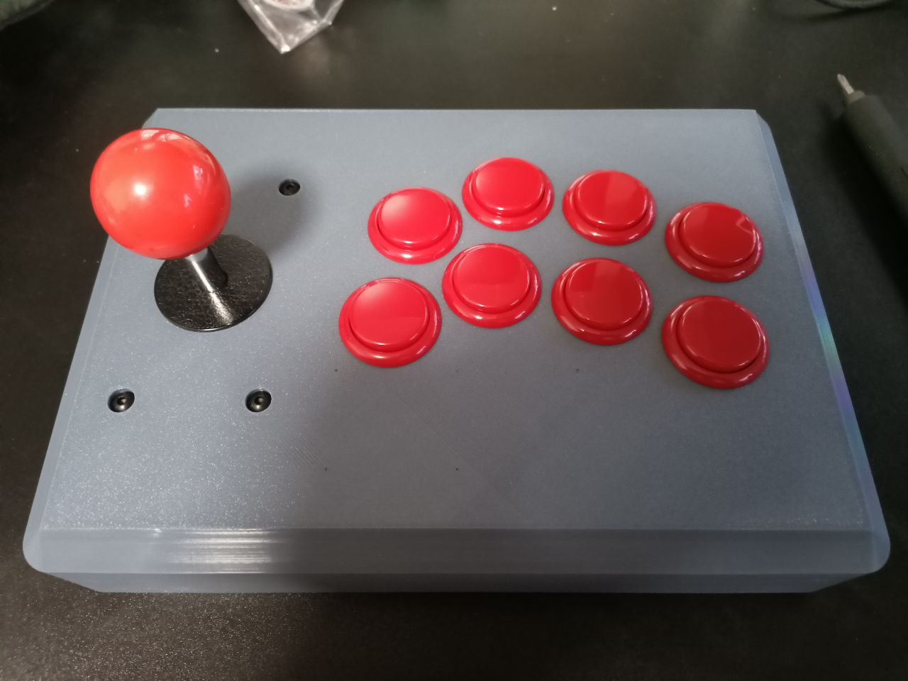

# fightstick

An open-source USB fight stick built around the [stm32f0-usbd-devboard](@@/p/stm32-usbd-devboards/stm32f0/), with a 3D-printable enclosure and arcade-grade controls.

For documentation please visit: https://rafaelmartins.com/p/fightstick/

