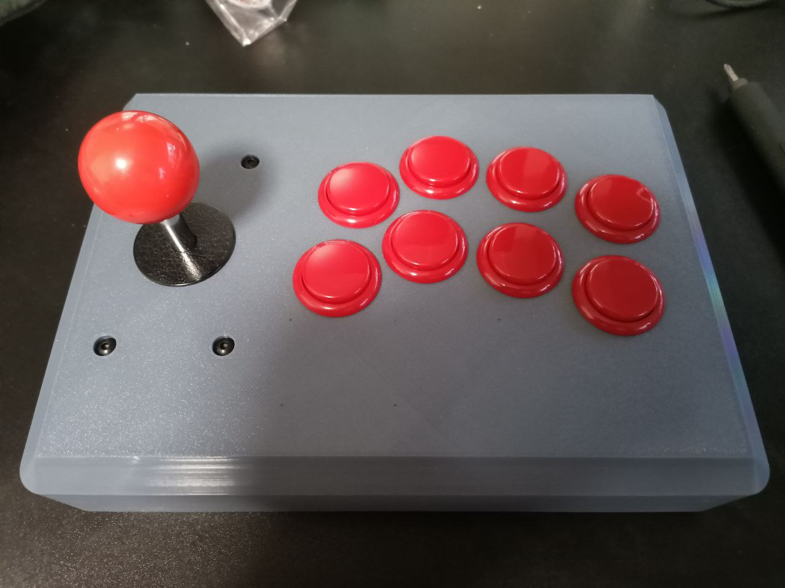

<!-- github-to-forgejo:notice:start -->
> [!IMPORTANT]
> Development has moved to [https://git.rafaelmartins.com/rafaelmartins/fightstick](https://git.rafaelmartins.com/rafaelmartins/fightstick). Please check [https://git.rafaelmartins.com/](https://git.rafaelmartins.com/) for details on how to contribute.
<!-- github-to-forgejo:notice:end -->

# fightstick

An open-source USB fight stick built around the [stm32f0-usbd-devboard](@@/p/stm32-usbd-devboards/stm32f0/), with a 3D-printable enclosure and arcade-grade controls.

For documentation please visit: https://rafaelmartins.com/p/fightstick/

