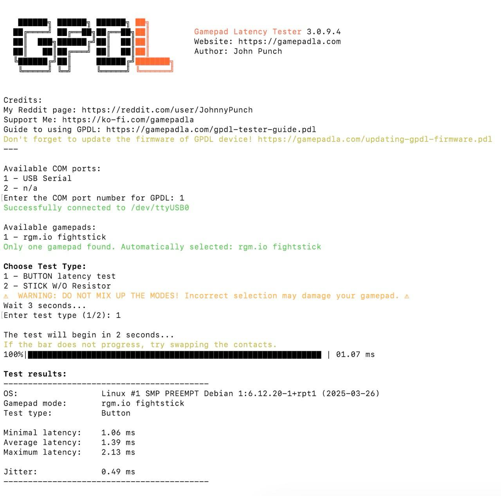

**An open-source USB fight stick built around the [stm32f0-usbd-devboard](@@/p/stm32-usbd-devboards/stm32f0/), with a 3D-printable enclosure and arcade-grade controls.**

The assembled fight stick, with a Sanwa JLF joystick and 30mm snap-in buttons

## Overview

fightstick is a USB gamepad designed for fighting games on Linux and MiSTer FPGA. It uses a [stm32f0-usbd-devboard](@@/p/stm32-usbd-devboards/stm32f0/) as its controller, a Sanwa JLF-TP-8YT joystick lever for directional input, eight Sanwa OBSF-30 game buttons, and four Sanwa OBSF-24 control buttons. The enclosure is fully 3D-printable.

The firmware is bare-metal C targeting the STM32F042K4 microcontroller, running at 48 MHz from the internal HSI48 oscillator. It presents itself as a standard USB HID gamepad with a 1 ms polling interval, requiring no custom drivers.

## Key highlights

- **Standard USB HID gamepad** -- no drivers required, works out of the box on Linux and MiSTer FPGA
- **1 ms polling interval** -- tested at 1.39 ms average button latency with a [Gamepad Latency Tester](https://gamepadla.com)
- **Sanwa arcade parts** -- JLF-TP-8YT joystick lever, OBSF-30 game buttons, and OBSF-24 control buttons
- **3D-printable enclosure** -- OpenSCAD parametric models for the panel and base plate
- **USB DFU firmware updates** -- enter DFU mode by pressing two buttons at startup, or flash via ST-Link
- **Bare-metal firmware** -- no HAL, no RTOS, built with [cmake-cmsis-stm32](@@/p/cmake-cmsis-stm32/) and [usbd-fs-stm32](@@/p/usbd-fs-stm32/)
- **Open source** -- hardware licensed under CERN-OHL-S-2.0, firmware under BSD-3-Clause

## How it works

The [stm32f0-usbd-devboard](@@/p/stm32-usbd-devboards/stm32f0/) reads 16 GPIO inputs (4 joystick directions and 12 buttons) using internal pull-up resistors. Each button and joystick microswitch connects its corresponding GPIO pin to ground. The firmware runs a USB HID interrupt IN endpoint that sends a 3-byte report containing a 2-axis digital joystick (X/Y values of -1, 0, or 1) and 12 button states at up to 1000 Hz. An on-board LED indicates USB enumeration status.

Gamepad Latency Tester results: 1.06 ms minimum, 1.39 ms average, 2.13 ms maximum, 0.49 ms jitter

## Explore further

- [Assembly](10_assembly.md) -- parts list, wiring, and 3D-printed enclosure
- [Firmware](30_firmware.md) -- building, flashing, architecture, and USB HID protocol
- [Source code](https://github.com/rafaelmartins/fightstick) -- GitHub repository
- [stm32f0-usbd-devboard](@@/p/stm32-usbd-devboards/stm32f0/) -- development board documentation
